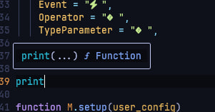

# neokinds 🥴 

ide-like pictograms for neovim lsp completion items, make your lsp icons much more attractive.

[](http://www.lua.org)
[](https://neovim.io)



## 🍺 Installation

```lua
{
    "BrunoCiccarino/neokinds",
    config = function ()
        local neokinds = require("neokinds"), 
        neokinds.setup({
            ...
        }),
    end
}
```

## ⚙️  Config 

```lua
local neokinds = require("neokinds")

neokinds.setup({
    icons = {
        error = "",
        warn = "",
        hint = "",
        info = "",
    },
    completion_kinds = {
        Text = " ",
        Method = "󰆧",
        Function = "󰊕",
        Constructor = " ",
        Field = "",
        Variable = " ",
        Class = "󰠱 ",
        Interface = " ",
        Module = " ",
        Property = "󰜢 ",
        Unit = " ",
        Value = " ",
        Enum = "練",
        Keyword = "󰌋",
        Snippet = "",
        Color = " ",
        File = " ",
        Reference = " ",
        Folder = " ",
        EnumMember = " ",
        Constant = " ",
        Struct = "",
        Event = " ",
        Operator = " ",
        TypeParameter = " ",
        Boolean = " ",
        Array = " ",
      },        
})

```

### 🎨 integration

<details>
<summary> blink-cmp config</summary>

```lua
local neokinds = require("neokinds")

require('blink-cmp').setup({
    completion = {
        list = { selection = function(ctx) return ctx.mode == "cmdline" and "auto_insert" or "preselect" end },
        menu = {
            border = "rounded",
            winhighlight = "Normal:NormalFloat,FloatBorder:FloatBorder,CursorLine:PmenuSel,Search:None",
            draw = {
                components = {
                    kind_icon = {
                        text = function(ctx)
                            
                            local icon = neokinds.config.completion_kinds[ctx.kind] or ""
                            return icon .. " " .. (ctx.kind or "")
                        end,
                        highlight = function(ctx)
                            
                            return "CmpItemKind" .. (ctx.kind or "Default")
                        end,
                    },
                },
            },
        },
    },
}
```
</details>

<details>
<summary> cmp config</summary>

```lua
 formatting = {
    format = function(entry, vim_item)
      vim_item.menu = ({
        nvim_lsp = "[LSP]",
        luasnip = "[Snippet]",
        buffer = "[Buffer]",
        nvim_lua = "[API]",
        path = "[Path]",
        calc = "[Calc]",
        emoji = "[Emoji]",
      })[entry.source.name] or ""
        vim_item.kind = string.format("%s %s", M.config.completion_kinds[vim_item.kind] or "", vim_item.kind)
    return vim_item
    end,
  },
```
</details>

## 🌐 Compatibility

- nvim-cmp: full support 
- blink-cmp full support

### 👏 Acknowledgements

- [mini.icons](https://github.com/echasnovski/mini.icons)
- [lspkind.nvim](https://github.com/onsails/lspkind.nvim)
